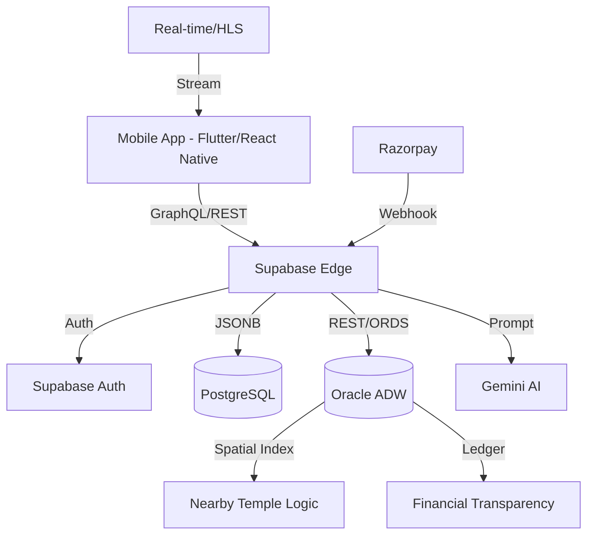

# Divya Platform: Backend Architecture & System Design

The Divya platform (Digital Mandir) employs a sophisticated hybrid architecture designed for extreme scalability, real-time engagement, and AI-driven spiritual guidance.

## 1. High-Level Architecture
Divya uses a **Co-Pilot Cloud Strategy**, balancing the agility of Supabase with the enterprise power of Oracle.

### Hybrid Database Strategy
- **Supabase (PostgreSQL)**: Handles the "Fast Loop." This includes Authentication, Real-time Chat, User Profiles, and high-frequency UI state.
- **Oracle (ADW/ORDS)**: Handles the "Heavy Lifting." This includes the Transparency Ledger, Oracle Spatial queries for "Temples Near Me," massive log aggregation, and complex financial reporting.
- **ORDS (Oracle REST Data Services)**: Acts as the translation layer, allowing Supabase Edge Functions to securely query the Oracle database via standard REST APIs.

## 2. Core Backend Components

### Edge Computing (Supabase Functions)
All business logic resides in **Deno-powered Edge Functions**. This ensures low latency by running code close to the user.
- **Security**: Enforces Row Level Security (RLS) and JWT verification for every request.
- **Connectivity**: Functions use the `ordsPost/ordsGet` shared utilities to sync data between Postgres and Oracle.

### AI Orchestration (The Gemini Layer)
Divya integrates Google's **Gemini AI** directly into the spiritual workflow:
- **DivyaBot**: A personalized spiritual guide that uses context-aware RAG (Retrieval-Augmented Generation) to answer dharma questions based on the user's preferred deity and temple.
- **Sankalp Assist**: An algorithm that takes a user's intent (e.g., "health for my parents") and generates a grammatically correct Sanskrit/Hindi *Sankalp* statement.
- **Fraud Detector**: Analyzes donation patterns to flag suspicious transactions before they reach the ledger.

## 3. Specialized Algorithms

### A. Spatial Proximity Algorithm
To find nearby temples, Divya doesn't just use simple math. It uses **Oracle Spatial**:
```sql
-- Uses R-tree indexing for sub-millisecond proximity search
SELECT * FROM DIVYA_TEMPLES 
WHERE SDO_WITHIN_DISTANCE(LOCATION, SDO_GEOMETRY(2001, 4326, SDO_POINT_TYPE(?, ?, NULL), NULL, NULL), 'distance=10 unit=KM') = 'TRUE';
```

### B. Escrow & Payment Flow
Payments are processed via **Razorpay** but managed through a custom **Escrow Algorithm**:
1. **Initial Charge**: Money is collected and status set to `escrow`.
2. **Verification**: AI checks the "Puja Proof" (photo/video) uploaded by the Pandit.
3. **Release**: The `release-escrow` function is triggered only after the devotee acknowledges or the AI verifies compliance, ensuring 100% transparency.

## 4. Streaming & Real-time
Divya handles "Live Darshan" and Real-time notifications through two distinct channels:

### Live Streaming (Darshan)
- **Infrastructure**: Integrated with a CDN-backed streaming provider (storing HLS URLs in `DIVYA_LIVE_STREAMS`).
- **State Management**: The backend tracks `VIEWER_COUNT` and `STATUS` (Scheduled, Live, Ended) to provide a seamless "Join Now" experience on the mobile app.

### Real-time Notifications
- **Supabase Realtime**: Uses PostgreSQL logical replication to push updates (e.g., "Your puja has started") directly to the mobile app via WebSockets, bypassing traditional polling.

## 5. System Design Diagram


## Summary of Algorithms Used:
1. **K-Nearest Neighbors (KNN)**: For temple discovery.
2. **Sentiment Analysis**: For aggregating temple reviews into AI summaries.
3. **HMAC-SHA256**: For secure payment signature verification.
4. **Finite State Machine (FSM)**: To manage complex Booking states (Pending -> Confirmed -> In Progress -> Completed).
