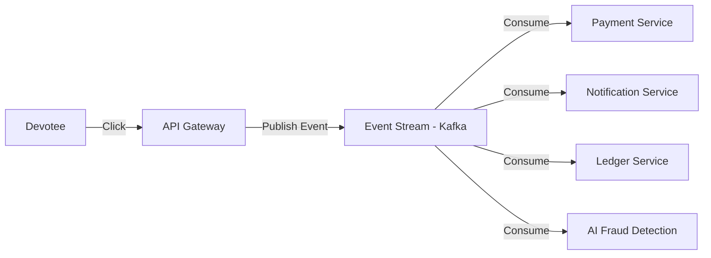

# Next-Level Scaling: The "Hyper-Scale" Blueprint

To scale from millions to **billions of concurrent operations**, we must move beyond traditional "Server-Database" thinking. As a systems architect, here is how we would build Divya to handle the entire world's spiritual traffic.

## 1. The "Distributed Ledger" Challenge
When 100 million people donate ₹11 at the exact same moment during a Live Aarti:
- **The Problem**: A single database table will lock up (deadlock) trying to update the `TOTAL_RAISED` amount.
- **The Next-Level Solution**: **Distributed Write Aggregation**.
- **The Example**: We don't update the total in real-time. Instead, we use a high-throughput **Event Stream** (like Kafka or Redpanda).
  - Every donation is an "Event."
  - "Aggregator Services" pull 1,000 events at a time and do a single "Batch Update" to the database every 500ms.
  - **Result**: 100 million writes become only 100,000 database operations.

## 2. Global Data Consistency (Multi-Region Synchronization)
If a user in London books a Pandit in Varanasi, and another user in Dubai tries to book the same Pandit at the same time:
- **The Problem**: One user might see the Pandit as "Available" because the data hasn't synced across oceans yet.
- **The Next-Level Solution**: **Global Distributed Locks (Raft/Paxos Consensus)**.
- **The Example**: We use a globally distributed key-value store (like Cloud Spanner or TiDB).
  - Before a booking is confirmed, the server in London must "Agree" with the server in India that they both have the same view of the Pandit's calendar.
  - Using a **Consensus Algorithm**, the system ensures that **two people can never book the same slot**, even if they are on opposite sides of the planet.

## 3. Edge-Native Data (Reducing Latency to Zero)
- **The Problem**: Even at the speed of light, data takes 150ms to travel from the US to India.
- **The Next-Level Solution**: **Edge Data Replication**.
- **The Example**: We move the *data* to the edge, not just the code. 
  - Using a tool like **Turso (LibSQL)** or **Durable Objects**, each major city (London, SF, Tokyo) has a "Local Cache" of the Pandit's availability.
  - The "Read" happens instantly from the local city. Only the "Final Commit" travels back to the main Oracle database in India.

## 4. Architectural Shift: Event-Driven Everything
Instead of `User -> Request -> Database`, we move to **Event Sourcing**:

- **Why?**: If the "Notification Service" goes down, the "Payment" still works. Once notifications come back online, it reads the "Events" it missed and sends the alerts. The system is **Self-Healing**.

## 5. The "Maha Aarti" Streaming Strategy
Streaming 4K video to 1 billion people simultaneously:
- **The Next-Level Solution**: **Peer-to-Peer (P2P) Assisted Mesh Streaming**.
- **The Example**: Instead of every user downloading from our server, the users' phones share the video data with each other (WebRTC Mesh).
- **Result**: Our server only needs to send data to 1,000 "Seeds," and those 1,000 seeds distribute it to the rest of the billion. We save 99% on bandwidth costs.

## Summary: The 3 Pillars of Next-Gen Scaling
1. **Asynchronous Processing**: Never wait for the database during high load. Use queues.
2. **Horizontal Everything**: If a server is full, click a button and add 100 more.
3. **Decentralized Data**: Trust "Local Agreement" first, "Global Sync" second.
